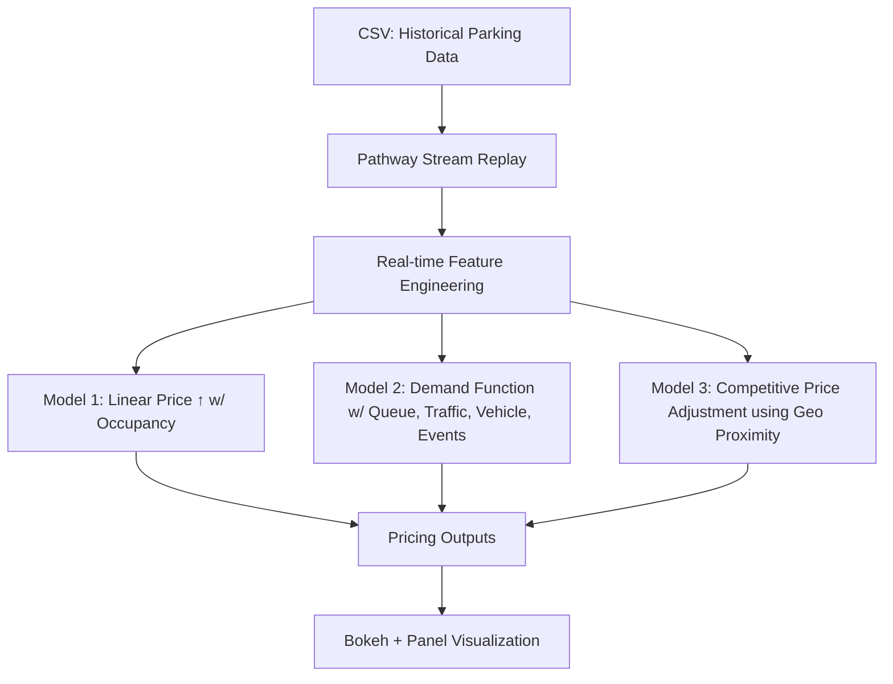

# 🚗 Dynamic Pricing for Urban Parking Lots

Capstone Project — Summer Analytics 2025
Hosted by Consulting & Analytics Club × Pathway

---

## 📌 Overview

Urban parking spaces are a limited and highly demanded resource. Static pricing often leads to inefficiencies like overcrowding or underutilization. This project simulates a real-time dynamic pricing system for 14 urban parking spaces using real data streams.

Participants were tasked with building an intelligent, data-driven pricing engine using historical patterns, demand signals, and competition insights — all implemented using only **Python, pandas, numpy**, and **Pathway**.

---

## 🛠 Tech Stack

* **Python 3.10** — core programming language
* **pandas, numpy** — data processing and demand modeling
* **Pathway** — real-time data stream simulation and windowed analytics
* **Bokeh + Panel** — real-time, interactive visualizations
* **Geopy** — compute distances between parking lots for competitive modeling
* **Google Colab** — development and simulation environment

---

## 🧱 Architecture Diagram (Mermaid)



---

## 🔄 Project Workflow

1. **Data Preparation**

   * 73 days of data across 14 parking spaces, each sampled at 30-minute intervals.
   * Columns include occupancy, capacity, queue length, vehicle type, congestion, special day, and coordinates.

2. **Streaming with Pathway**

   * Data ingested using `replay_csv()` simulating a real-time environment.
   * Time-stamped and logically windowed by day and parking lot ID.

3. **Pricing Models:**

   * **Model 1 (Baseline Linear)**

     * Price increases linearly with occupancy ratio.
     * `Price = base + α * (Occupancy / Capacity)`

   * **Model 2 (Demand-Based)**

     * Combines features into a weighted demand signal:

     ```
     Demand = α·(Occ/Cap) + β·Queue − γ·Traffic + δ·IsSpecial + ε·VehicleTypeWeight
     Price = BasePrice · (1 + λ · NormalizedDemand)
     ```

   * **Model 3 (Competitive Pricing)**

     * Computes distances to nearby lots.
     * If nearby lots are cheaper and current lot is full → price drops / rerouting suggested.
     * If nearby lots are expensive → price increases moderately.

4. **Visualization**

   * Real-time Bokeh plots embedded via Panel.
   * Line plots for Models 1–3 with timestamps.

---

## 📁 Repository Contents

```
dynamic-parking-pricing/
├── dataset.csv                
├── app.ipynb                 
├── pricing_models.py          
├── utils.py                   
├── README.md                  
└── report.pdf                
```

---

## 📌 Notes

* All pricing models were implemented **from scratch** with no ML libraries.
* The repository is **public** and accessible for reviewers.
* The notebook has been tested to work **error-free** on Google Colab.

---

##
